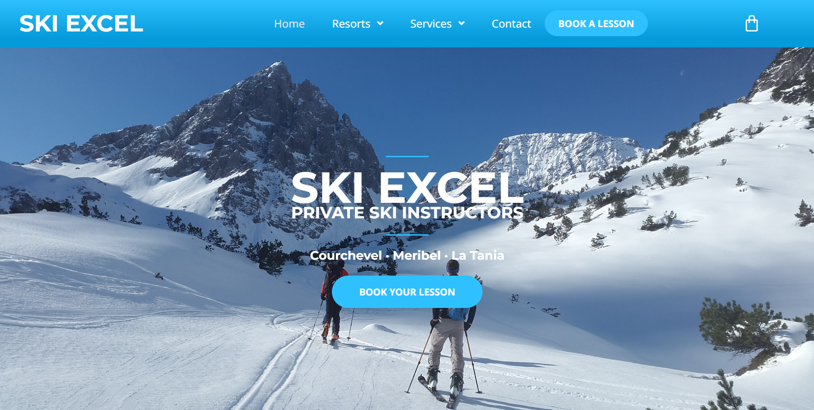
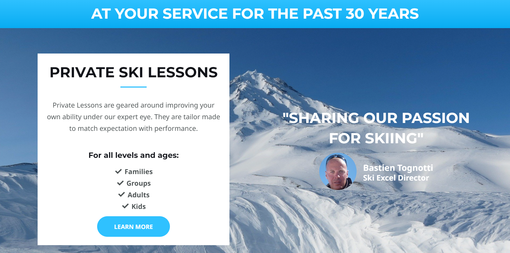
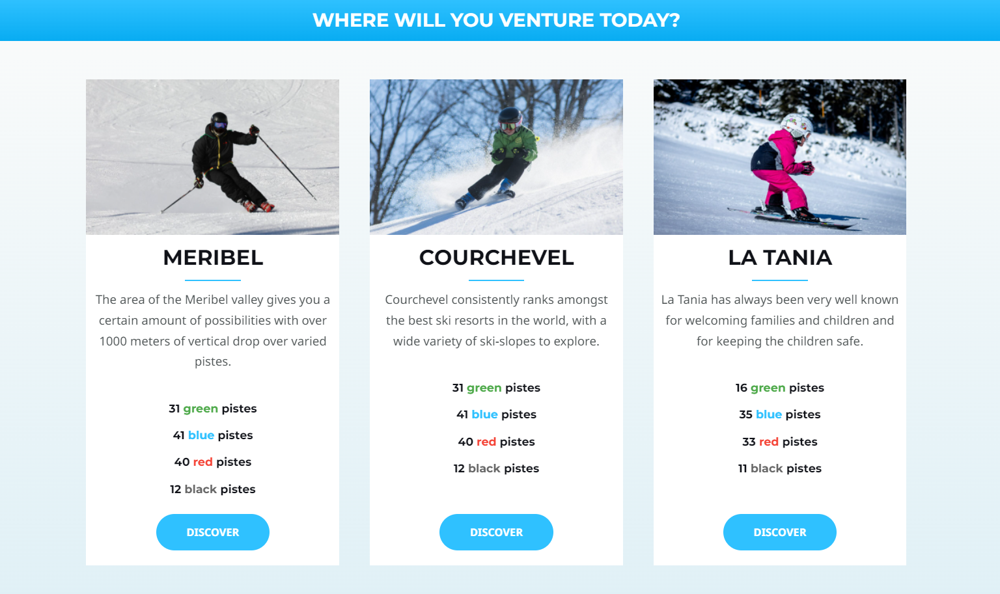
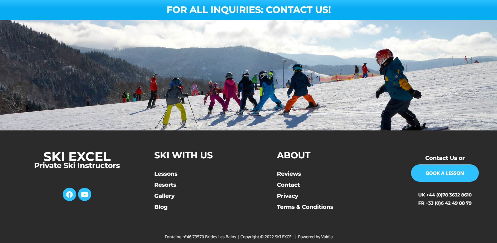
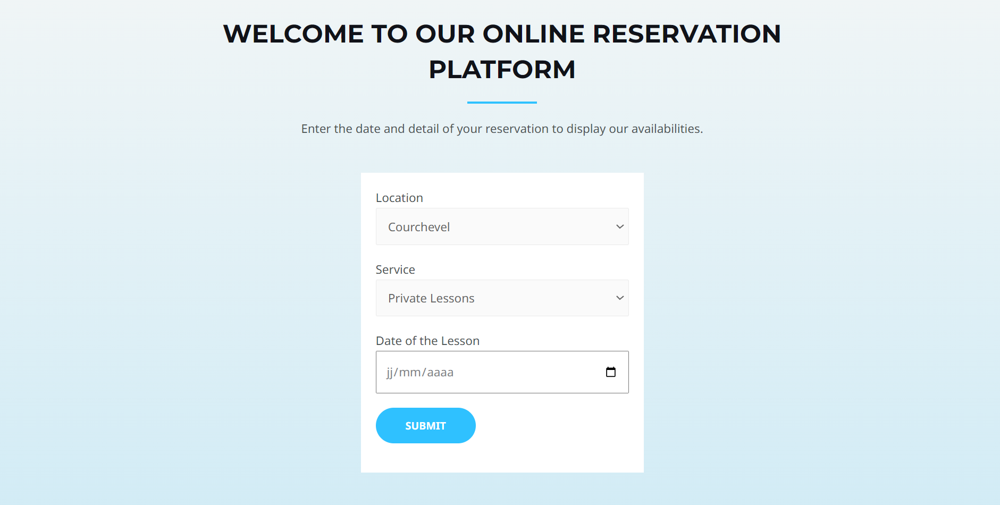
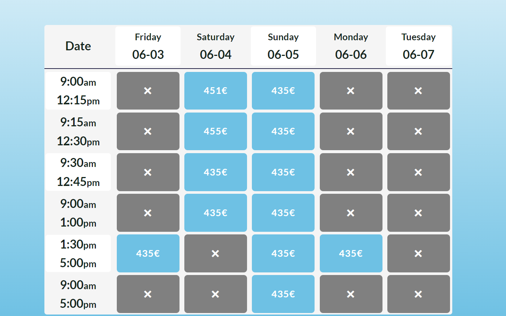
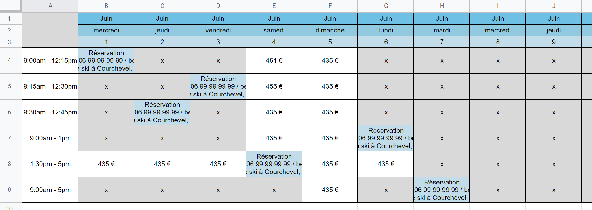

# Ski Courses Reservation Module

This repo is a Wordpress plugin to handle ski reservations.
It computes the answers given in a form to display available courses.
A caldendar made with Google Sheets alows agenda management.
This calendar automaticly updates when a course is booked.
*Dossier présentant un plugin Wordpress pour un module de réservation de cours de ski.
Après un questionnaire, il affiche les horraires disponibles.
Un calendrier fait sur Google Sheets permet de gérer les cours disponibles.
Ce calendrier se met à jour automatiquement après une réservation.*

## Home page:

The Home page of the project:  
*Page d'accueil*

## Form:

Information selection:  
*Sélection des informations*

## Form result:

The answers are them used to display the calendar:  
*Les réponses sont utilisées pour afficher le calendrier*

## Google Sheet Calendar:

Google Sheet calendar to open courses:  
*Caldendrier sur Google Sheets pour ouvrir des créneaux*

